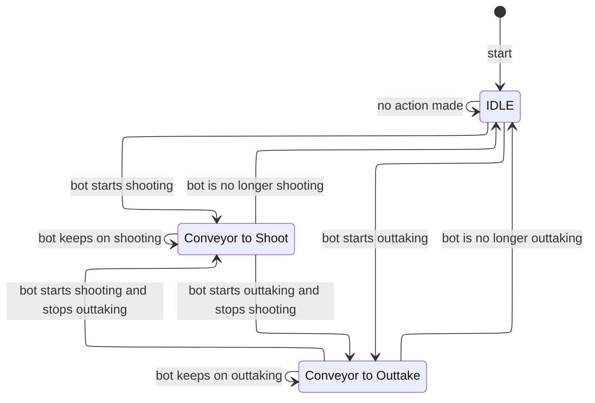

# Agitator FSM Spec

```mermaid
---
config:
  layout: elk
---
stateDiagram-v2
    state "IDLE" as IDLE
    state "Conveyor to Shoot" as SHOOT_CONVEYOR
    state "Conveyor to Outtake" as OUTTAKE_CONVEYOR

    [*] --> IDLE: start
    IDLE --> IDLE: no action made
    IDLE --> SHOOT_CONVEYOR: bot starts shooting
    SHOOT_CONVEYOR --> IDLE: bot is no longer shooting
    IDLE --> OUTTAKE_CONVEYOR: bot starts outtaking
    OUTTAKE_CONVEYOR --> IDLE: bot is no longer outtaking
    SHOOT_CONVEYOR --> SHOOT_CONVEYOR: bot keeps on shooting
    OUTTAKE_CONVEYOR --> OUTTAKE_CONVEYOR: bot keeps on outtaking
    OUTTAKE_CONVEYOR --> SHOOT_CONVEYOR: bot starts shooting and stops outtaking
    SHOOT_CONVEYOR --> OUTTAKE_CONVEYOR: bot starts outtaking and stops shooting
```