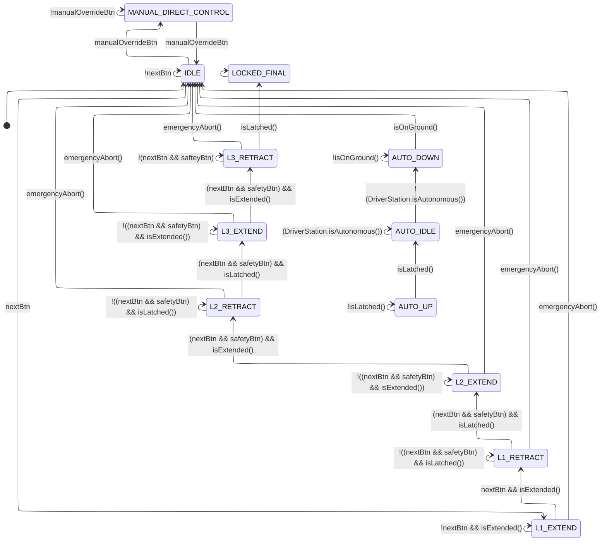

# Climber FSM Spec

```mermaid
---
config:
  layout: elk
  title: Climber State Diagram
---
stateDiagram
  direction BT
  [*] --> I
  I --> I:!nextBtn
  MDC --> MDC:!manualOverrideBtn
  I --> MDC:manualOverrideBtn
  MDC --> I:manualOverrideBtn
  I --> L1E:nextBtn
  L1E --> L1E:!nextBtn && isExtended()
  L1R --> L1R:!((nextBtn && safetyBtn) && isLatched())
  L2E --> L2E:!((nextBtn && safetyBtn) && isExtended())
  L2R --> L2R:!((nextBtn && safetyBtn) && isLatched())
  L3E --> L3E:!((nextBtn && safetyBtn) && isExtended())
  L3R --> L3R:!(nextBtn && safteyBtn)
  LF --> LF
  L1E --> L1R:nextBtn && isExtended()
  L1R --> L2E:(nextBtn && safetyBtn) && isLatched()
  L2E --> L2R:(nextBtn && safetyBtn) && isExtended()
  L2R --> L3E:(nextBtn && safetyBtn) && isLatched()
  L1E --> I:emergencyAbort()
  L1R --> I:emergencyAbort()
  L2E --> I:emergencyAbort()
  L2R --> I:emergencyAbort()
  L3E --> I:emergencyAbort()
  L3R --> I:emergencyAbort()
  L3E --> L3R:(nextBtn && safetyBtn) && isExtended()
  L3R --> LF:isLatched()
  AU --> AI:  isLatched()
  AI --> AD: !(DriverStation.isAutonomous())
  AD --> I: isOnGround()
  AU --> AU: !isLatched()
  AI --> AI: (DriverStation.isAutonomous())
  AD --> AD: !isOnGround()
  I:IDLE
  MDC:MANUAL_DIRECT_CONTROL
  L1E:L1_EXTEND
  L1R:L1_RETRACT
  L2E:L2_EXTEND
  L2R:L2_RETRACT
  L3E:L3_EXTEND
  L3R:L3_RETRACT
  AD:AUTO_DOWN
  AU:AUTO_UP
  AI: AUTO_IDLE
  LF:LOCKED_FINAL
```