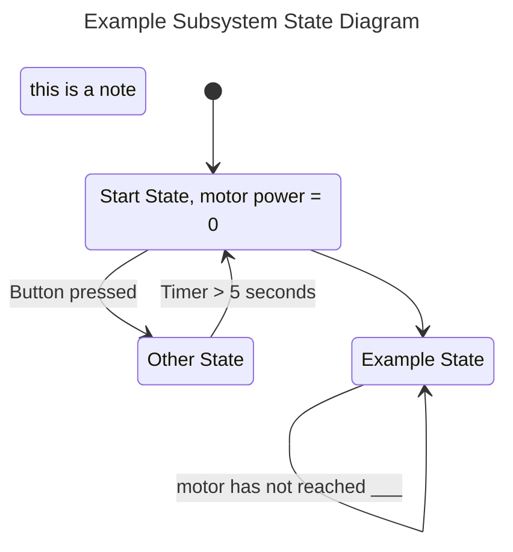

# Example FSM Spec

```mermaid
---
title: Example Subsystem State Diagram
---
stateDiagram-v2
  state "Start State, motor power = 0" as START_STATE
  state "Other State" as OTHER_STATE
  state "Example State" as E

  note: this is a note

  [*] --> START_STATE
  START_STATE --> OTHER_STATE: Button pressed
  START_STATE --> E
  E --> E: motor has not reached ___
  OTHER_STATE --> START_STATE: Timer > 5 seconds
```