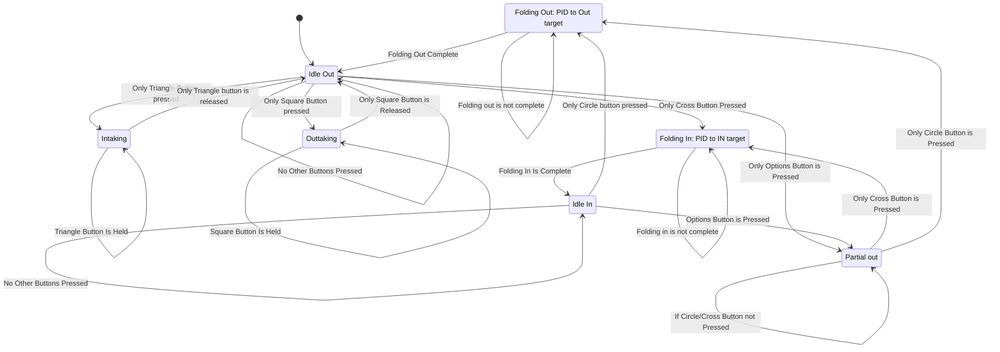

# Intake FSM Spec

```mermaid
stateDiagram-v2
  state "Folding Out: PID to Out target" as FOLD_OUT_STATE
  state "Intaking" as INTAKE_STATE
  state "Idle In" as IDLE_IN_STATE
  state "Idle Out" as IDLE_OUT_STATE
  state "Outtaking" as OUTTAKE_STATE
  state "Partial out" as PARTIAL_OUT_STATE
  state "Folding In: PID to IN target" as FOLD_IN_STATE

  [*] --> IDLE_OUT_STATE 
  IDLE_IN_STATE --> FOLD_OUT_STATE: Only Circle button pressed
  FOLD_OUT_STATE --> IDLE_OUT_STATE: Folding Out Complete 
  IDLE_OUT_STATE --> INTAKE_STATE: Only Triangle Button pressed
  IDLE_OUT_STATE --> OUTTAKE_STATE: Only Square Button pressed
  INTAKE_STATE --> IDLE_OUT_STATE: Only Triangle button is released
  OUTTAKE_STATE --> IDLE_OUT_STATE: Only Square Button is Released
  IDLE_OUT_STATE --> FOLD_IN_STATE: Only Cross Button Pressed
  FOLD_IN_STATE --> IDLE_IN_STATE: Folding In Is Complete
  INTAKE_STATE --> INTAKE_STATE: Triangle Button Is Held
  OUTTAKE_STATE --> OUTTAKE_STATE: Square Button Is Held
  IDLE_OUT_STATE --> IDLE_OUT_STATE: No Other Buttons Pressed
  IDLE_IN_STATE --> IDLE_IN_STATE: No Other Buttons Pressed
  FOLD_OUT_STATE --> FOLD_OUT_STATE: Folding out is not complete
  FOLD_IN_STATE --> FOLD_IN_STATE: Folding in is not complete
  IDLE_OUT_STATE --> PARTIAL_OUT_STATE: Only Options Button is Pressed
  PARTIAL_OUT_STATE --> FOLD_IN_STATE: Only Cross Button is Pressed
  PARTIAL_OUT_STATE --> FOLD_OUT_STATE: Only Circle Button is Pressed
  PARTIAL_OUT_STATE --> PARTIAL_OUT_STATE: If Circle/Cross Button not Pressed
  IDLE_IN_STATE --> PARTIAL_OUT_STATE: Options Button is Pressed
```